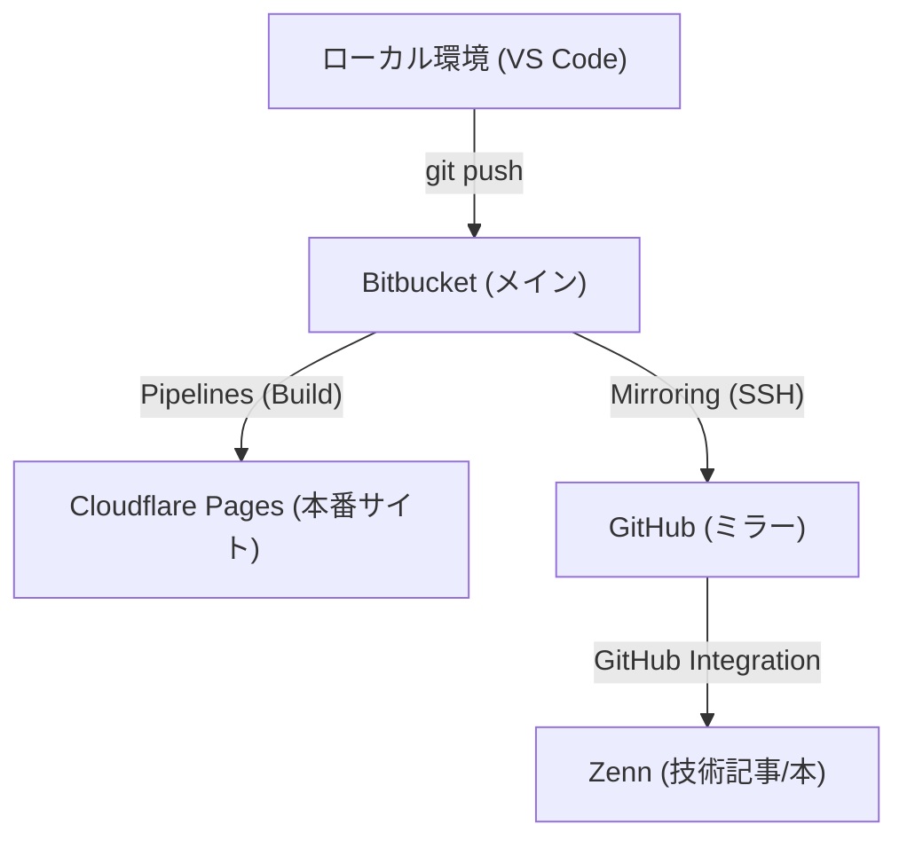

# 継続的デプロイ (CI/CD) の構築

この記事で構築した、マルチプラットフォーム配信の全体像は以下の通りです。

## 実装のステップ

1. **bitbucket-pipelines.yml** の作成。
2. **Cloudflare API Token** の発行。
3. Bitbucket の環境変数にトークンをセット。

:::message
この自動化を行うことで、記事を書いて `git push` するだけで全世界の CDN に最新の状態が反映されるようになります。本質的な執筆作業に集中できる環境です。
:::
