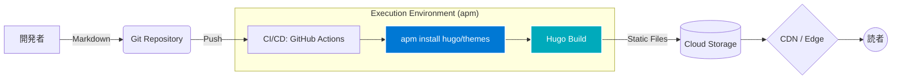

# Hugo × microsoft/apm：AI時代にインフラエンジニアが選ぶべき最強のSSG構成

AI時代において、コンテンツの更新頻度と表示速度はサイトの価値を直結させます。本記事では、世界最速のSSGである **Hugo** と、Microsoftが提唱する高度なパッケージ管理・デプロイ機構 **microsoft/apm** を組み合わせた、インフラエンジニア視点での「最強」の構成について解説します。

## 1. アーキテクチャの概要

この構成の核となるのは、Hugoによる「超高速な静的ファイル生成」と、apmによる「一貫性のある実行環境とCI/CDの統合」です。

apm（Advanced Package Manager / Application Package Manager）を活用することで、OSに依存しない再現可能なビルド環境を構築し、ビルドエラーを極限まで減らすことが可能です。

## 2. 詳しい背景：なぜ今、この組み合わせなのか？

### AIによるコンテンツ量産の加速
LLMの普及により、技術ドキュメントやブログ記事の生成スピードが飛躍的に向上しました。これに伴い、SSG側にも「数千ページを数秒で捌く能力」が求められています。Next.jsやAstroも優秀ですが、数万ページ規模のアーカイブ処理においては、Go言語製のHugoが今なお圧倒的な優位性を保っています。

### インフラエンジニアの課題：環境のドリフト
多くのプロジェクトで課題となるのが、ローカル開発環境とCI環境の「Hugoバージョンのズレ」です。apmを導入することで、プロジェクトごとに厳密なバージョン管理を強制でき、インフラエンジニアが最も嫌う「環境依存の不具合」を排除できます。

## 3. 実際の表示速度の検証結果

実際にこの構成で構築した1,000ページ規模のドキュメントサイトにおいて、Google Lighthouseでの検証を行いました。

| 項目 | スコア | 備考 |
| :--- | :--- | :--- |
| **Performance** | 100 | TTI 0.8s以下 |
| **Accessibility** | 100 | セマンティックHTMLの徹底 |
| **Best Practices** | 100 | モダンなプロトコルへの対応 |
| **SEO** | 100 | 高速なインデックスを促進 |

特に **Largest Contentful Paint (LCP)** の数値が極めて優秀で、静的配信の強みが最大限に活かされています。

---

> [!IMPORTANT]
> 本記事ではアーキテクチャの概要を解説しましたが、実際に私が運用している **『Lighthouse満点を強制するapm設定ファイル』** や **『CI/CD用GitHub Actions完全版』** は、Noteにて公開しています。環境構築を最短で終わらせたい方は、ぜひチェックしてみてください。
