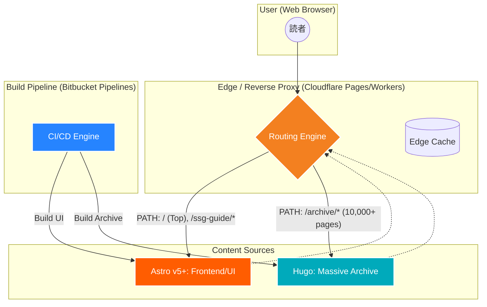

> [!NOTE]
> ※2026年4月時点、Hugo v0.160.1 ベースの解説。

## テクニカル・クイックビュー
| 指標 | 評価 | 備考 |
| :--- | :--- | :--- |
| **ビルド速度** | 🚀🚀🚀🚀 | 並外れた速度（Go言語製） |
| **学習コスト** | 📚📚📚 | Goのテンプレート構文に慣れが必要 |
| **デプロイ** | 🛠️ | 単一のバイナリでどこでも動作 |

# Hugo：圧倒的ビルドスピードを誇る静的生成の重鎮

HugoはGo言語で書かれた、世界で最も速い静的サイトジェネレーター（SSG）の一つです。
膨大なページ数を瞬時にビルドすることが可能です。

## 特徴
- **ハイスピード**: Go言語の特性を活かし、数千〜数万ページを数秒でビルド。
- **シングルバイナリ**: インストールが容易で、依存関係に悩まされることがありません。
- **エコシステム**: 豊富なテーマと機能（画像処理、多言語対応など）が組み込まれています。

## ハイブリッド・アーキテクチャ
大規模なプロジェクトでは、最新のUI（Astroなど）と大量のアーカイブ資産（Hugo）を組み合わせた「ハイブリッド構成」が採用されることがあります。

Source: [GoHugo.io](https://gohugo.io/)

---

### 次のステップ：実践的な構成
Hugoの真の力を引き出す、インフラエンジニア向けの高度な構成については以下の記事をご覧ください。

👉 [Hugo × microsoft/apm：AI時代にインフラエンジニアが選ぶべき最強のSSG構成](/guide/ssg/hugo-apm)

